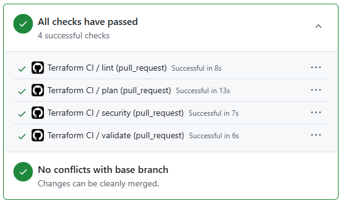
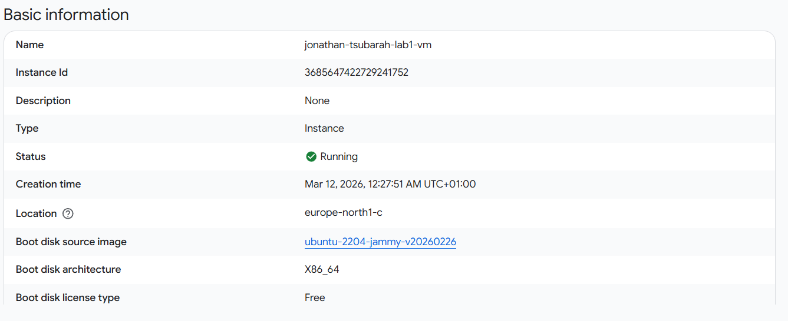

# Lab 1 Terraform

I den här labben har jag använt Terraform för att skapa en Linux-VM i Google Cloud. Jag har också lagt till ett startup-script för enkel hårdning, en daglig backup-policy och en GitHub Actions-pipeline för att kontrollera koden.

## Hur man kör projektet

terraform init
terraform plan
terraform apply

## Säkerhetsval

I startup-scriptet använde jag ufw, fail2ban och unattended-upgrades.

Jag valde ufw för att begränsa inkommande trafik, fail2ban för att minska risken för upprepade inloggningsförsök och unattended-upgrades för att hålla systemet uppdaterat med säkerhetsuppdateringar.

## Kommentar

Under arbetet stötte jag på att vissa resurser redan fanns i GCP. Därför behövde jag importera dem till Terraform state i stället för att skapa allt från början. Det gjorde att en manuell apply i GitHub Actions kunde ge felet already exists, trots att resurserna redan fanns.

## Screenshots

Pipeline screenshot:

VM screenshot från GCP Console:

